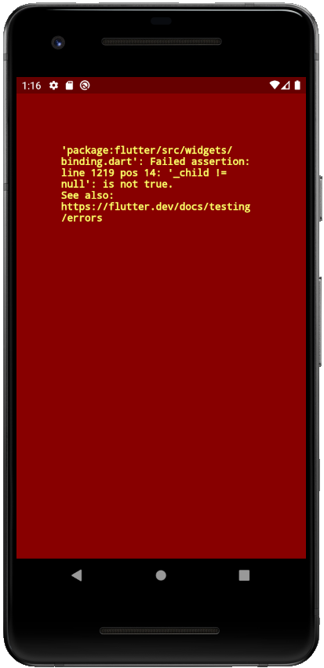
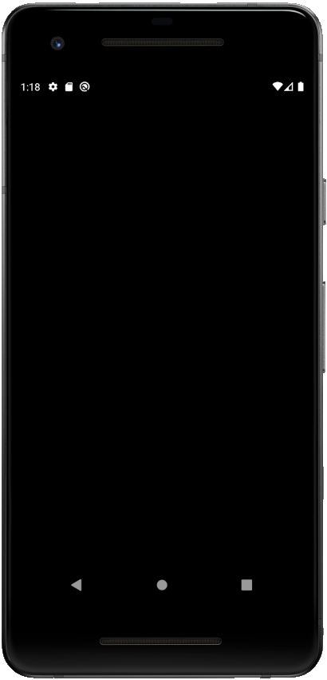
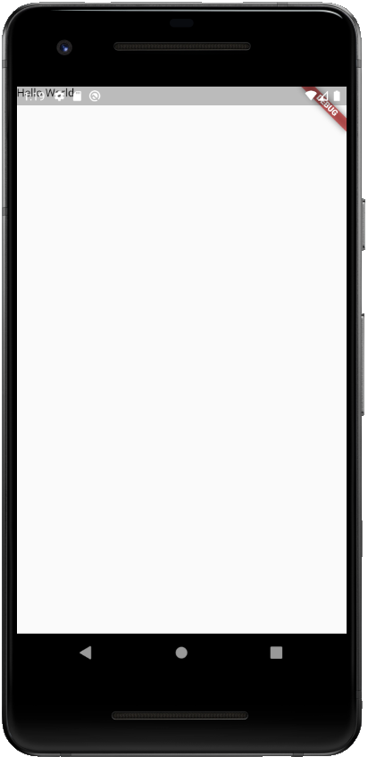
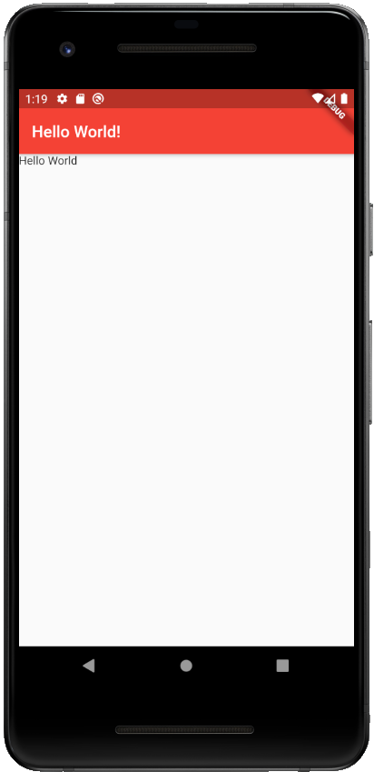
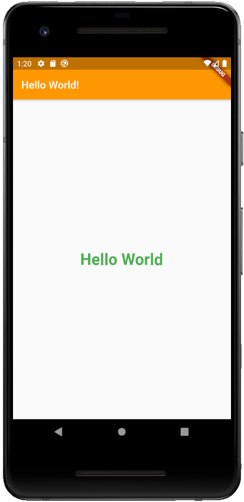

# Beginners' Guide to Flutter Development

Welcome to the Beginners' Guide to Flutter Development hosted by Google's Developer Student Club (DSC) program!

This is an eight week workshop series every Thursday, 7:00 - 8:30 EDT from Oct 1, 2020 to Nov 19, 2020.

This series will cover all the Flutter skills all the way from the basics to the advanced level.
By the end of this series, you'll be able to build complex, robust, and attractive Flutter apps for iOS, Android and the web.

Register now on EventBrite: [bit.ly/flutterdate](https://bit.ly/flutterdate)

## 1. Hello World App

There's a higher omnipotent deity that tells us to start each new CS language we learn with a "Hello World" app. The last time someone disobeyed this deity, their apartment was found vacant and there was no trace of that person.

For the sake of our safety, we will do what this deity wants. Hence, our first app with be the, yup you guessed it — "Hello World" app.

### Structure

The app has been divided into steps. Each step has starter and solution code. You can access each code set using the respective branches.

A recommended way to follow this repo is to compare the starter and solution branches for each step.
You can do this on GitHub or in Android Studio/VS Code.

[How to compare branches on GitHub](https://docs.github.com/en/free-pro-team@latest/github/committing-changes-to-your-project/comparing-commits#comparing-branches)
[How to compare branches on Android Studio](https://medium.com/better-programming/how-to-use-git-in-android-studio-part-2-93cec67b91b0#:~:text=Go%20to%20%E2%80%9CVSC%E2%80%9D%20%2D%3E,choose%20%E2%80%9CCompare%20with%20current%E2%80%9D.&text=A%20popup%20%E2%80%9CCompare%20feature%20with,to%20commits%2C%20files%20to%20files.)
[How to compare branches on Android Studio](https://stackoverflow.com/a/57833947/11547064)

### Steps

1. Writing main()

2. Creating our MyApp widget

3. Creating our MaterialApp widget with a Scaffold and Text.

4. Adding an AppBar

5. Styling our Text widget

### Skills Learned

* Intro to Flutter
* Text
* Scaffold
* MaterialApp
* Default Material Design colors with Colors
* TextStyle
